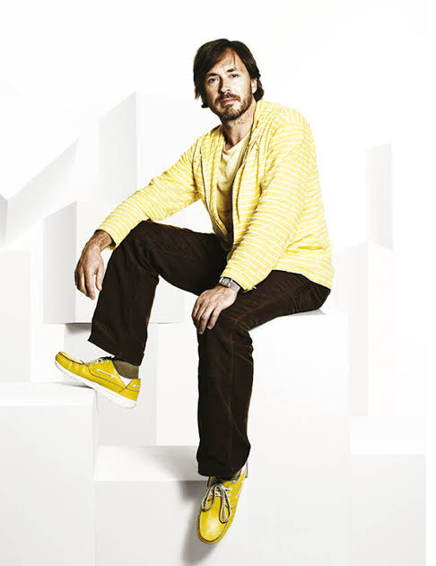

# Nombre Apellido

## Perfil

**Disciplina / formación:** Marcelo Mathias Picero Sandoval     
**Qué hago hoy:** Docente Diseño industrial     
**Qué me gustaría aprender en este curso:** Dinamizar la información 

## Intereses

- Tema o disciplina 1 Literatura
- Tema o disciplina 2 Cine
- Tema o disciplina 3 Fotografía 

## Una pregunta que me interesa explorar

Escribe una pregunta pequeña que pueda transformarse en reglas, datos, geometría, imágenes o interacción.

¿Como influye el ruido en alumnos de primer ciclo neurodivergentes?

## Algo que me inspira

Agrega una imagen local en `assets/images/`

## Links

- [Referencia 1](https://example.com)
- [Referencia 2](https://example.com)

> No es necesario publicar información personal que no quieras compartir. Este README será parte de un repositorio público durante el laboratorio.
